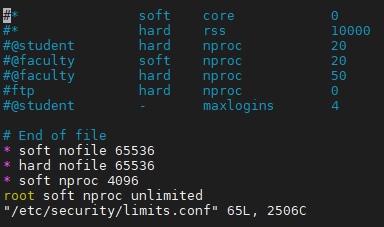
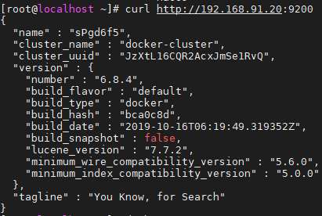

# ElasticSearch

## 1.简介

​	elasticsearch是一个基于lucence的服务器，它提供了一个分布式全文搜索引擎，对外基于restful web接口提供服务，它是基于java开发的应用。

## 2.功能分类

​	elasticsearch具备两个主要功能：

​	1.搜索。功能和solr类似

​	2.分析。结合LogStach使用

## 3.相关概念

### 	3.1.cluster

​	集群由一个或多个节点组成，其中有一个主节点，主节点可以通过选举产生，主节点是对于集群内部而言。对于外部来说，集群是一个整体，访问任何一个节点就等价于与整个集群通信。所以，主节点的存在不会产生单点安全隐患和并发访问瓶颈等问题。（阈值：(n/2)+1）

### 	3.2.shards

​	（1）primary shard：代表索引的主分片。es可以把一个完整的索引分成多个primary shard，这样的好处是可以把一个大的索引拆分成多个分片，分别存储在不同的es节点上，从而形成分布式存储，并为搜索提供分布式服务，提高并发处理能力。分片的数量只能在索引创建时指定。索引创建后不能再更改primary shard的数量。

​	（2）replica shard：代表索引主分配的副本（从分片）。es可以设置多个replica shard。作用是：1.提高系统的容错性，当某个节点某个primary shard损坏或者丢失时可以从副本中恢复。2.提高es的查询效率，es会自动对搜索请求进行负载均衡，将并发的搜索请求发送给合适的节点，增强并发处理能力。

*注：主分片和从分片不能放在一个节点上，每一个节点上不能有重复的从分片。*

​		*主分片读和写，从分片只读。*

​		*一般主分片比从分片多1个。如10个主分片9个从分片。*

​		*主分片一旦设置不可更改，从分片可以。*

### 3.3.Index

​	索引。相当与关系型数据库中的表。其中

### 3.4.Type

类型，是一个抽象的概念。底层还是存的一个，只是逻辑区分，从不同角度看的而已。每个索引中都必须有一个Type。Type时index中的一个逻辑分类。es中的数据Document是存储在索引下的Type中的。

*注意：es5.x及更低版本中，一个index中可以有多个Type。es6.x版本之后，Type被弱化，一个Index中只能有唯一的一个Type。在es7.x版本后，删除Type。*

### 3.5.Document

文档。es中的最小数据单元。一个Document就是一条数据，一般使用json数据结构表示。每一个Index下的Type中都可以存储多个Document。一个Document中可以定义多个field，field就是数据字段。

### 3.6.元数据

在es中所有以"_"开头的属性都称为元数据，都有着自己特定的含义。例如：“_index”表示索引

### 3.7.倒排索引|反向索引

对数据进行分析，抽取出数据中的词条，以词条作为key，对应数据的存储位置作为value，实现索引的存储。这种索引称为倒排索引。倒排索引是Document写入es时分析维护的。

## 4.docker安装es

### 4.1.修改linux系统限定配置

`vim /etc/security/limits.conf`

新增：

`* soft nofile 65536`

`* hard nofile 65536`

`* soft nproc 4096`
`root soft nproc unlimited`

如图：

注：

soft nofile ：可打开的文件描述符的最大数(超过会警告);
hard nofile ：可打开的文件描述符的最大数(超过会报错);

soft nproc ：单个用户可用的最大进程数量(超过会警告);

65536和4096时es启动时的要求信息，否则es启动不了

### 4.2.修改系统控制文件（该文件是管理系统中的各种资源控制的配置文件）

`vim /etc/sysctl.d/99-sysctl.conf`

新增:

`vm.max_map_count=655360`

该文件不会立即生效，使用命令立即刷新生效：`sysctl -p`

### 4.3.安装es

`docker pull elasticsearch:6.8.4`

`docker run -d --name elasticsearch -p 9200:9200 -p 9300:9300 elasticsearch:6.8.4`

注：

由于es是java编写，默认启动会占用2G堆内存，内存不足则无法启动。可以启动时添加设置内存大小：`-e ES_JAVA_OPTS="-Xms256m -Xmx256m"`

启动后访问如图所示则安装成功：curl http://192.168.91.20:9200

## 5.安装es管理工具Kibana

`docker pull kibana:6.8.4`

`docker run -it -d -e ELASTICSEARCH_URL=http://192.168.91.20:9200 --name kibana --link elasticsearch:elasticsearch -p 5601:5601 kibana:6.8.4`

注：

启动后浏览器访问：http://192.168.91.20:5601

## 6.常用es管理操作

### 6.1.查看信息

#### 6.1.1.查看集群健康状态    

?v表示带有标题头

`GET /_cat/health?v`

#### 6.1.2.查看索引信息

`GET /_cat/indices?v`

#### 6.1.3.查看集群中节点信息

`GET /_cat/nodes?v`

#### 6.1.4.查看分片信息

`GET /_cat/shards?v`

### 6.2.索引操作

#### 6.2.1.创建

命令语法：PUT 索引名[索引配置参数]

index名称**<u>必须小写</u>**，且不能以下划线'_',	'-',	'+'开头，不能包含字符	,	\	*	\\\	<	>	|	/	?	""

每个索引默认5个主分片，5个从分片（索引的主分片数5，每个主分片的副本数1）

`PUT my_index`

#### 6.2.2.创建索引并指定分片

注意：编写时大括号不能和put命令在一行（不能把{放在索引名后，kibana会把{当成索引的一部分）

`PUT second_index`
`{`
  `"settings": {`
    `"number_of_shards": 2,`
    `"number_of_replicas": 0`
  `}`
`}`

注：磁盘空间不足15%时从分片不再分配，不足5%时主分片不在分配

#### 6.2.3.修改索引

命令：PUT 索引名/_setting{索引配置参数}

注意：索引一旦创建，primary shards数量不可变化，可以改变replica shards的数量

`PUT my_index/_settings`
`{`
  `"number_of_replicas": 0`
`}`

#### 6.2.4.删除索引

命令：DELETE 索引名

支持删除多个，DELETE index1,index2,index3...

`DELETE my_index,second_index`

### 6.3.Document操作

#### 6.3.1.添加文档

es中向一个不存在的索引中添加数据自动创建索引，索引的主分片数5，每个主分片的副本数1

`PUT my_index/my_type/1`
`{`
  `"name":"zhangjianhua",`
  `"age":27,`
  `"gender":"man",`
  `"info": {`
    `"card_id":"342923199410253110"`
  `},`
  `"hobbies":["eat","java","sleep","game","study"]`
`}`

`POST my_index/my_type`
`{`
  `"name":"zhangsan",`
  `"age":25,`
  `"gender":"man",`
  `"info": {`
    `"card_id":"342923199410253110"`
  `},`
  `"hobbies":["eat","java","sleep","game","study"]`
`}`

注：POST和PUT的区别是POST能够保证在分布式环境下id是唯一的，而PUT使用的是uuid

#### 6.3.2.索引查询

##### 1.主键查询：索引名称/索引类型/id

`GET my_index/my_type/2`

##### 2.多值查询

`GET my_index/my_type/_mget
{
  "docs": [
      {
        "_id":"1"`
      `},`
      `{`
        `"_id":"2"
      },
      {
        "_id":"3"`
      `}`
    `]`
`}`

##### 3.查询全部

GET 索引名/索引类型/_search

#### 6.3.3.修改

##### 1.全量替换

命令:	POST/PUT 索引名/索引类型/唯一ID

​			json数据

`POST my_index/my_type/2`
`{`
  `"name":"zhangsan",`
  `"age":25,`
  `"gender":"man",`
  `"info": {`
    `"card_id":"342923199410253110"`
  `},`
  `"hobbies":["eat","java","sleep","game","study"]`
`}`

本操作相当于覆盖操作。全量替换过程中，elasticsearch不会真的修改Document中的数据，而是标记elasticsearch中原有的document为deleted状态，再创建一个新的document来存储数据，当elasticsearch中的数据量过大时，elasticsearch后台回收deleted状态的document。

##### 2.部分更新

命令：POST 索引名称/索引类型/唯一ID/_update

​			json数据

`POST my_index/my_type/2/_update`
`{`
  `"doc":{`
    `"name":"lisi"`
  `}`
`}`

#### 6.3.4.删除

DELETE 索引名称/索引类型/唯一ID

`DELETE my_index/my_type/2`

#### 6.3.5.批量增删改（*常用）

使用bulk语法执行批量增删改，语法格式如下：

注意：_bulk的两个{}json串都不要出现换行等操作，两个{}使用回车符进行识别。

`POST _bulk
{"create":{"_index":"my_index","_type":"my_type","_id":"3"}}`
`{"name":"test_create__3"}
{"create":{"_index":"my_index","_type":"my_type","_id":"3"}}
{"name":"test_create__3_1"}`
`{"index":{"_index":"my_index","_type":"my_type","_id":"4"}}
{"name":"test_create__4"}
{"index":{"_index":"my_index","_type":"my_type","_id":"2"}}`
`{"gender":"women"}`
`{"delete":{"_index":"my_index","_type":"my_type","_id":"9"}}
{"update":{"_index":"my_index","_type":"my_type","_id":"8"}}`
`{"doc":{"married":false}}`

备：create强制新增，若id存在的则执行失败，不存在新增一条

​		index若id不存在，新增一条，若存在则覆盖

​		delete删除

​		update修改

以上相同索引、类型可以合并简写：

`POST my_index/my_type/_bulk
{"create":{"_id":"3"}}`
`{"name":"test_create__3"}
{"create":{"_id":"3"}}
{"name":"test_create__3_1"}`
`{"index":{"_id":"4"}}
{"name":"test_create__4"}
{"index":{"_id":"2"}}`
`{"gender":"women"}`
`{"delete":{"_id":"9"}}
{"update":{"_id":"8"}}`
`{"doc":{"married":false}}`

## 7.分词器（analyzer）和标准化处理（normalization）

### 7.1.es默认提供常见分词器

standard analyzer 是es中的默认分词器。标准分词器，处理英语语法的分词器。切分过程中不会忽略停止词（如：the、a、an等）。会进行单词的大小转换、过滤连接符（-）或括号等常见符号。

要切分的句子：Set the shape semi-transparent by calling set_trans(5)

切分后的句子：set, the, shape, to, semi, tranparent, by, calling, set_trans, 5

**standard analyzer** 

`GET _analyze`
`{`
  `"text":"Set the shape semi-transparent by calling set_trans(5)",`
  `"analyzer": "standard"`
`}`

**simple analyzer** 

`GET _analyze`
`{`
  `"text":"Set the shape semi-transparent by calling set_trans(5)",`
  `"analyzer": "simple"`
`}`

**whitespace analyzer** 

`GET _analyze`
`{`
  `"text":"Set the shape semi-transparent by calling set_trans(5)",`
  `"analyzer": "whitespace"`
`}`

**language analyzer**

`GET _analyze`
`{`
  `"text":"我们在一起",`
  `"analyzer": "chinese"`
`}`

### 7.2.安装中文分词器

IK分词器提供了两种analyzer，分别是ik_max_word和ik_smart。

ik_max_word：会将文本做最细粒度的拆分，会穷尽各种可能组合。

ik_smart：会做最粗粒度的拆分。

**1.进入容器**

`docker exec -it elasticsearch /bin/bash`

**2.运行bin目录下的`elasticsearch-plugin`**

`./bin/elasticsearch-plugin install https://github.com/medcl/elasticsearch-analysis-ik/releases/download/v6.8.4/elasticsearch-analysis-ik-6.8.4.zip`

**或者：**

先下载https://github.com/medcl/elasticsearch-analysis-ik/releases/download/v6.8.4/elasticsearch-analysis-ik-6.8.4.zip压缩包，上传到服务器，然后复制压缩包到容器：docker cp path/elasticsearch-analysis-ik-6.8.4.zip 容器名称:/usr/share/elasticsearch/plugins,然后容器内创建目录make dir，容器内移动压缩包到目录mv elasticsearch-analysis-ik-6.8.4.zip ik/，容器内解压缩unzip elasticsearch-analysis-ik-6.8.4.zip，删除zip文件。

**3.重启容器**

`docker restart elasticsearch`

**4.ik_max_word analyzer**

`GET _analyze`
`{`
  `"text":"今天心情不错哦",`
  `"analyzer": "ik_max_word"`
`}`

**5.ik_smart**

`GET _analyze`
`{`
  `"text":"今天心情不错哦",`
  `"analyzer": "ik_smart"`
`}`

## 8.es中的mapping问题

Mapping在elasticsearch中是一个非常重要的概念，决定了一个index中的field使用什么数据格式存储，使用什么分词器解析，是否有子字段等。

为什么需要Mapping？

如果没有mapping所有text类型属性默认都使用standard分词器。所以如果希望使用IK分词器就必须配置自定义mapping。

### 8.1.mapping核心数据类型

es中的数据类型有很多，在这里只介绍常用的几种数据类型。

`只有text类型才能被分词。其他类型不允许。`

文本（字符串）：text

整数：byte、short、integer、long

浮点型：float、double

布尔类型：boolean

日期类型：`date yyyy-MM-dd HH:mm:ss:SSS`

数组类型：array []

对象类型：object {}

不分词的字符串（关键字）：keyword

### 8.2.dynamic mapping对字段的类型分配

true or false -> boolean

123 -> long

123.123 -> float

hello word -> text

2021-01-01 -> date

[] -> array

{} -> object

在上述的自动mapping字段类型分配的时候，只有text类型的字段需要分词器。默认分词器是standard分词器。

### 8.3.查看索引mapping

`GET my_index/_mapping`

### 8.4.custom mapping

可以通过命令，在创建index和type的时候来定制mapping映射，也就是指定字段的类型和字段数据使用的分词器。

`手工定制mapping时，只能新增mapping设置，不能对已有的mapping进行修改。`

通常都是手工创建index，并进行各种定义。如：settings，mapping等。

`PUT test_mapping`
`{`
  `"settings": {`
    `"number_of_shards": 2,`
    `"number_of_replicas": 0`
  `},`
  `"mappings": {`
    `"test_type":{`
      `"properties":{`
        `"name":{`
          `"type":"text",`
          `"analyzer":"ik_max_word"`
        `}`
      `}`
    `}`
  `}`
`}`

## 9.es中的搜索详情

### 9.1.query string search

search的参数都是类似http请求头中的字符串参数提供搜索条件的。

`GET /index_name/type_name/_search?parameter_name=parameter_value&...`

#### 9.1.1全搜索

timeout参数：是超时史称定义。代表每个节点上的每个shard执行搜索时最多耗时多久。不会影响响应的正常返回。只会影响响应中的数据的数量。

`GET 索引名/类型名/_search?timeout=10ms`

#### 9.1.2.multi index搜索

multi index搜索：所谓的multi_index就是从多个index中搜索数据。相对使用较少，只有在复合数据搜索的时候可能出现。一般来说，如果真使用复合数据搜索，都会使用_all。

`GET _search`

`GET 索引名1,索引名2.../_search`	#多个index中的数据

`GET 索引名/类型名/_search`	#同一个index中type数据

`GET indexPrefix_*/_search`	#通配符搜索,搜索前缀xxx的索引

`GET *_indexSuffix/_search`	#通配符搜索,搜索后缀xxx的索引

`GET _all/_search`	#all代表所有索引

`GET 索引名/_search?q=字段名:搜索条件	如：GET test_search/test_type/_search?q=age:26`

#### 9.1.3.分页搜索

默认情况下，es搜索返回结果是10条数据。从第0条开始查询。

size和from是es中具有特定含义的属性名。

GET 索引名/_search?size=10	#size查询数据的行数

GET 索引名/_search?from=0&size=10	#从第几行开始查询，行号从0开始

#### 9.1.4.+/-搜索

`GET 索引名/_search?q=字段名:条件`

`GET 索引名/_search?q=+字段名:条件`

`GET 索引名/_search?q=-字段名:条件`

+：和不定义符号含义一样，就是搜索指定的字段中包含key words的数据

-：与+符号含义相反，就是搜索指定的字段中不包含key words的数据

#### 9.1.5.排序

`GET 索引名/_search?sort=字段名:排序规则`

`GET test_search/_search?sort=age:asc`

`GET test_search/_search?sort=age:desc`

### 9.2. query DSL

